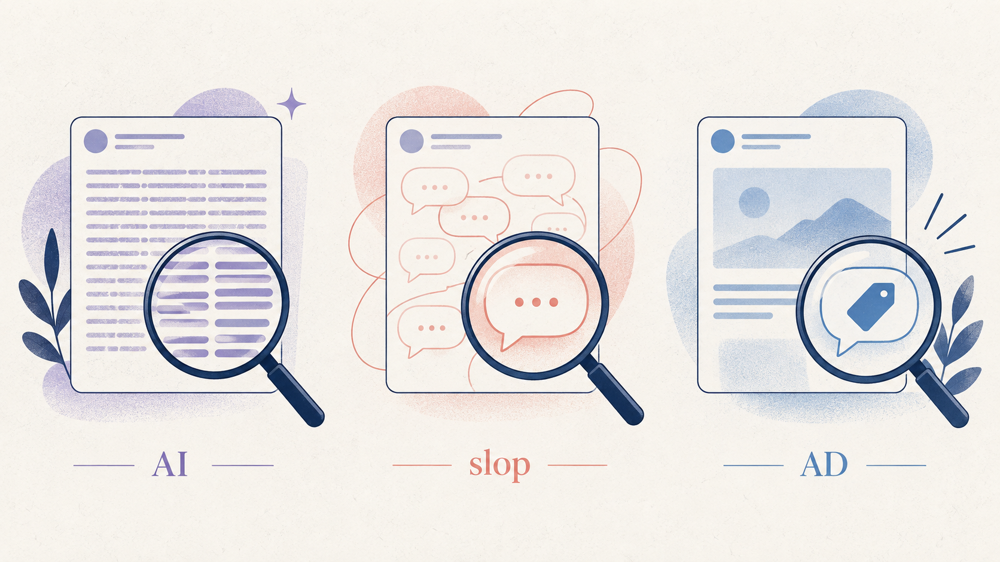

# 我给 X 做了一副“透镜”：看清时间线里的 AI、灌水和软广

刷 X 的时候，我越来越在意一件事：眼前这条内容，到底值不值得读？

有些回复很工整，但看完像什么都没说；有些帖子看起来在分享经验，读到最后却是在推销产品。它们不一定都来自 AI，也不一定都没有价值，但辨认这些内容确实需要花一点精力。

于是，我做了一个 Chrome 插件：**X Lens，推文透镜**。

它读取当前页面里可见的推文和评论，用 Jev 做判断，再在推文右上角、Grok 按钮左边放几个小标签。

## 三个标签，分别回答三个问题

| 标签 | 想回答的问题 |
| --- | --- |
| 紫色 **AI** | 这段文字是否疑似由 AI 生成？ |
| 红色 **slop / 垃圾** | 这段内容是否属于低价值灌水、垃圾信息或互动诱饵？ |
| 蓝色 **Ad / 广告** | 这段内容是否带有广告、推广或软广意图？ |

这三个判断是独立的。

AI 写的内容也可能有价值，真人写的东西也可能是灌水。广告更不等于垃圾：一条有用的产品介绍，也可能带着明确的推广目的。因此，一条推文可以出现一个标签，也可以同时出现多个标签。

<!-- 截图 1：请在这里插入真实时间线截图，展示 Grok 左侧的小标签。 -->
**【截图 1：时间线中的 AI、slop 和广告标签】**

标签刻意做得比较小。它不是弹出来要求你处理的通知，而是阅读时可以顺手看一眼的提示。点击标签，右上角会显示这条内容的分类评分。

*配图为概念插画，不是插件界面截图。*

## 我把一个复杂的方案，又改回了简单的方案

最初，我想做得更积极一点：发现疑似垃圾推文，就询问是否屏蔽作者。

后来觉得弹窗太频繁，又加了一层账号复查：到作者主页，看看最近几条原创是不是都像垃圾内容，再决定是否提醒。

这套逻辑做出来了，但也带来了额外的页面加载、请求和等待。更关键的是，我最想解决的问题只是：**帮我判断正在看的这一条内容。**

所以，我取消了账号复查，并把自动屏蔽提示改成了默认关闭的可选项。

默认情况下，X Lens 只做三件事：读取当前内容、独立分类、显示标签。它不会主动访问作者主页，也不会替我完成屏蔽。

## 自动屏蔽提示，现在可以自己决定

有时我只想安静地看标签，有时又希望插件在遇到 slop 时提醒一下。因此，X Lens 加了一个 **“自动弹出屏蔽提示”** 开关，放在插件设置里，默认关闭。

关闭时，插件只显示当前推文或评论的标签。开启后，只有当前内容命中 **slop** 才会询问是否屏蔽作者；单独出现 **AI** 或 **广告** 标签不会触发提示，也不会进入作者主页做二次验证。

为了减少打扰，同一页面中的同一账号只提示一次，两次提示至少间隔 30 秒。点击“暂不屏蔽”即可关掉这次提示；这个去重规则只针对当前页面，刷新后会重新计数。

即使选择“屏蔽账号”，插件也只会打开 X 的原生确认窗口，最终仍需我亲自确认。想恢复安静模式，取消勾选开关并保存即可。

## 评论也会判断

除了首页时间线，推文详情页下面的文字评论也会参与检测。向下滚动时，新进入可见区域的内容会陆续处理。

页面右上角会显示检测数量，以及 AI、slop、广告分别命中了多少条。这样，即使没有出现标签，也能区分“还在检测”和“这条没有达到标记阈值”。

<!-- 截图 2：请在这里插入真实详情页截图，展示评论标签和右上角状态。不要截入 API Key。 -->
**【截图 2：详情页评论检测与右上角状态】**

## 它怎么工作？

核心判断交给 TypeSafe 的 Jev。每条正文在一次请求里回答三个独立问题，插件再根据返回的评分决定是否显示标签。

默认阈值是 **65%**，可以在设置里调整。调高会更保守，调低会更容易出现标签。这个数字是模型对当前问题的评分，**不是工具经过评测后达到的准确率**。

插件采用 Chrome Manifest V3，没有前端框架或额外运行依赖。请求在后台串行处理，并缓存一部分正文评分，减少重复请求。源码里也保留了分类逻辑、异常响应和推文正文识别的测试。

## 怎么安装？

代码已经放在 GitHub：**[penouc/x-lens](https://github.com/penouc/x-lens)**。

1. 从仓库 Releases 下载插件压缩包，解压到一个固定文件夹。
2. 在 Chrome 打开 chrome://extensions，开启“开发者模式”。
3. 点击“加载已解压的扩展程序”，选择解压后的文件夹。
4. 打开插件设置，填写自己的 TypeSafe API Key，启用自动检测并保存。
5. 刷新 X 页面，开始浏览。

目前通过本地加载方式安装，还没有上架 Chrome 应用商店。

## 有些边界，需要说清楚

X Lens 提供的是阅读提示，不是作者身份鉴定。只看一段文字，不能证明作者是否真的使用了 AI；“广告”标签也不代表已证实存在付费合作。

它目前只处理文字，不分析图片、视频或外链内容，也不会主动展开隐藏回复。

启用检测后，当前可见推文和评论的正文会发送到 TypeSafe API，可能产生 API 费用。密钥保存在本机的扩展存储里，不会硬编码进公开仓库，也不会通过 Chrome 同步存储上传。插件不会把 X 登录 Cookie 发送给 Jev。

这是一个还在迭代的小工具。X 的页面结构会变化，模型也会误判；目前没有可公布的准确率评测。

我希望 X Lens 做到的，是给阅读多一点线索，而把是否相信、是否继续读的决定留给自己。

---

项目：[GitHub · X Lens](https://github.com/penouc/x-lens)
模型接口：[TypeSafe Jev 文档](https://docs.typesafe.ai/introduction/quickstart)
